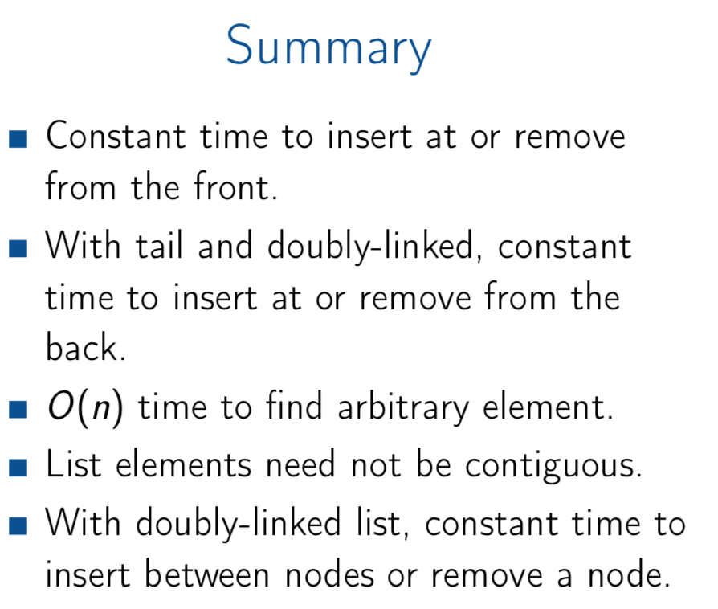

# Linked List

## Singly-linked List
head is a variable of type "point to node". It stores the address of the head node.
so head.next will be 10, since head point to 7.
 ### List API
 
|   |   |
|---|---|
|PushFront(Key) | add to front |
|Key TopFront() | return front item  |
| PopFront() | remove front item |
| PushBack(Key)  | add to back |
| Key TopBack()  | return back item |
| PopBack() | remove back item |
| Boolean Find(Key) | is key in list? |
| EraseKey) | remove key from list |
| Boolean Empty() | empty list?|
| AddBefore(Node, Key)| add key before node|
| AddAfter(Node, Key) | add key after node|

#### PopFront()    
    if head == nil:
        ERROR: Empty list
    head = head.next
    if head == nil //when there is only one node in the linked list, and has been poped up.
        tail = nil
        
#### PushFront(key)            
    node = new Node();
    node.key = key;
    node.next = head;
    head = node;
    
    if tail = nil; //Empty list, so tail will point to what head point to.
       tail = head 
       
### PopBack()       O(n)
    if head == nil;
       ERROR Empty list
    if head = tail; //only one node
        head <- tail <- nil;
    p = head;
    while(p.next.next != nil){
        p = p.next
    }
    p.next = nil;
    tail = p;
       
### PushBack(key)  //1. without a tail
    node = new Node();
    node.key = key;
    node.next = nil
    
    if tail == nil:  //Empty list
       head <- tail <- node
    
    tail.next = node
    tail = node
    
### AddAfter(node, key)
    node2 = new Node();
    node2.key = key;
    node2.next = node.next;
    node.next = node2
    if tail == node;  //Only one node;
    tail = node2

### AddBefore(node, key)    O(n) 
       node2 = new node();
       node2.key = key;
       
       if tail == nil:
          head <- tail <- node2
       if head == node
          node2.next = node
          head = node2
        
       while(p.next.key != node.key) {
            p = p.next
       }
       
       node2.next = node;
       p.next = node2
   
### Time Complexity

 
## Doubly-linked List 

### PushBack(key)
    node = new Node();
    node.key = key;
    node.next = nil;
    
    if tail == nil:
        head <- tail <- node;
        node.pre = nil;

    else:
        tail.next = node;
        node.pre = tail
        tail = node;

### PopBack()
    if tail = nil:
        Error: Empty list
    if head = tail; //only one 
        head <- tail <- nil   
    tail = tail.pre;
    tail.next = nil;
    
### AddAfter(node, key)
    node2 = new node();
    node2.key = key;
    
    node2.next = node.next;
    node2.pre = node;
    node.next = node2;
    
    if node2.next != nil:
        node2.next.pre = node2
    if tail == node: // node2.next = nil
        tail = node2;
        
### AddBefore(node, key)
    
    node2 = new node();
    node2.key = key;
    node2.pre = node.pre;
    node2.next = node;
    node.pre = node2;
    
    if node2.pre != nil;
        node.pre.next = node2
    if head = node;
       head = node2;  //node2.pre = nil; only one node before insertion

